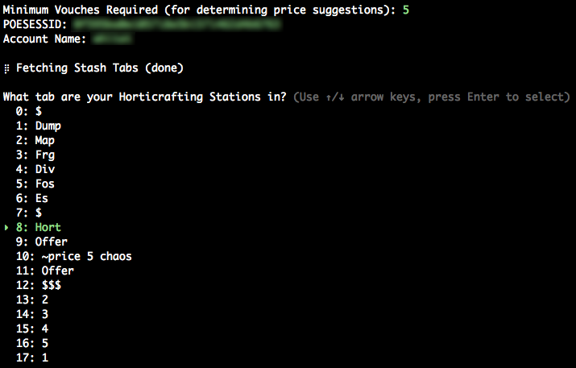
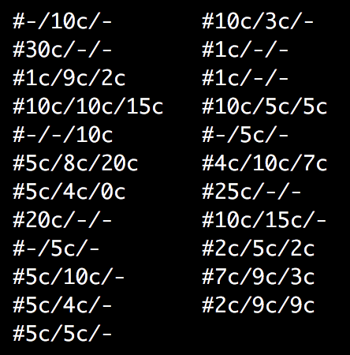
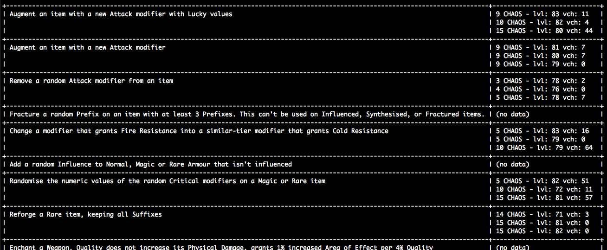

# Horticraft Pricing

Automatically fetch Horticraft Stations from your stash and generate suggested pricing notes for them based on Horticrafting Station crafts currently listed for sale on forbiddenharvest.com.

Caveats: Right now the automatic pricing is a very quick-and-dirty selection of the currently cheapest listed craft. I plan to enhance the capabilities based on looking at the N cheapest listings as well as considering craft ilevel. You can look at the raw data after the price suggestions to decide if you think the suggestion is reasonable.

## Requirements

* Ruby (developed with 2.7.1 but it should work with some older verisons no worries)

## Setup

* Clone the repository
* `bundle install`

## Run

* `ruby run.rb`

## Screenshots

#### Enter your details and select what tab contain your Horticrafting Stations

#### Suggested list price notes that match the location of the stations with the tab

#### Raw pricing data showing the cheapest three listings as well as that craft's ilevel and the sellers vouch count

